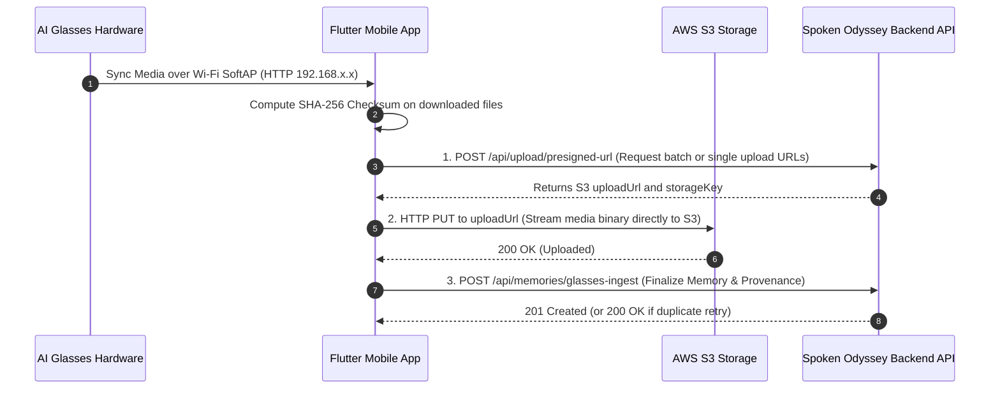

# Spoken Odyssey — Mobile AI Glasses API Integration Contract

> **Target Audience:** Flutter (Android & iOS) Mobile Engineers  
> **Backend Base URL:** `https://api.spokenodyssey.com/api` (or local development `http://localhost:5000/api`)  
> **Ownership Boundary:** Mobile engineers handle: Physical Glasses ↔ BLE ↔ Wi-Fi SoftAP ↔ Flutter ↔ API. Mobile engineers do NOT modify or deploy backend infrastructure.

---

## 🔁 Overview of the 3-Step Ingestion Flow



---

## 1. Authentication

All requests to the Spoken Odyssey API require an authenticated bearer token:
```http
Authorization: Bearer <FIREBASE_OR_SESSION_JWT_TOKEN>
Content-Type: application/json
```
The backend derives user ownership strictly from this token. **Never** attempt to spoof or provide `ownerId` or `userId` in the request body.

---

## 2. Step 1: Request Presigned Upload URLs

To ensure large video and audio files do **not** exhaust mobile bandwidth or server memory, all media files are uploaded directly to S3 via presigned PUT URLs.

### Endpoint
`POST /api/upload/presigned-url`

### Request (Batch Multi-Asset)
```json
{
  "files": [
    {
      "fileName": "VID_20260909_140001.mp4",
      "fileType": "video/mp4",
      "clientAssetId": "temp-vid-01"
    },
    {
      "fileName": "AUD_20260909_140001.aac",
      "fileType": "audio/aac",
      "clientAssetId": "temp-aud-02"
    }
  ]
}
```

### Response (`200 OK`)
```json
{
  "success": true,
  "data": {
    "items": [
      {
        "clientAssetId": "temp-vid-01",
        "fileName": "VID_20260909_140001.mp4",
        "fileType": "video/mp4",
        "uploadUrl": "https://spoken-odyssey-media.s3.amazonaws.com/memories/user_123/1725884000-vid-20260909-140001.mp4?X-Amz-Signature=...",
        "storageKey": "memories/user_123/1725884000-vid-20260909-140001.mp4"
      },
      {
        "clientAssetId": "temp-aud-02",
        "fileName": "AUD_20260909_140001.aac",
        "fileType": "audio/aac",
        "uploadUrl": "https://spoken-odyssey-media.s3.amazonaws.com/memories/user_123/1725884000-aud-20260909-140001.aac?X-Amz-Signature=...",
        "storageKey": "memories/user_123/1725884000-aud-20260909-140001.aac"
      }
    ],
    "count": 2
  }
}
```

*(Note: Single file uploads passing `{"fileName": "...", "fileType": "..."}` are also supported).*

---

## 3. Step 2: Stream File Directly to AWS S3

Use HTTP `PUT` to stream the binary buffer directly to the `uploadUrl` returned in Step 1:

```http
PUT <uploadUrl>
Content-Type: video/mp4
Content-Length: <fileSizeBytes>

<binary file content>
```

> ⚠️ **Important:** Presigned URLs expire in 15 minutes. If a network interruption occurs, re-request a new presigned URL before retrying the upload.

---

## 4. Step 3: Finalize Glasses Memory Ingestion

Once all media assets are successfully stored in S3, call the glasses ingestion endpoint.

### Endpoint
`POST /api/memories/glasses-ingest`

### Request Body
```json
{
  "deviceIdentifier": "DE:5B:F7:28:1A:09",
  "title": "Sunset Hike POV",
  "description": "Recorded hands-free while walking the ridge trail.",
  "privacy": "Private",
  "mood": "Peaceful",
  "tags": ["nature", "hiking", "sunset"],
  "albumId": null,
  "familyCircleId": null,
  "assets": [
    {
      "deviceMediaId": "VID_0042.mp4",
      "storageKey": "memories/user_123/1725884000-vid-0042.mp4",
      "originalName": "VID_0042.mp4",
      "mimeType": "video/mp4",
      "fileSize": 18500200,
      "durationSec": 45.2,
      "captureChecksum": "e3b0c44298fc1c149afbf4c8996fb92427ae41e4649b934ca495991b7852b855"
    },
    {
      "deviceMediaId": "AUD_0042.aac",
      "storageKey": "memories/user_123/1725884000-aud-0042.aac",
      "originalName": "AUD_0042.aac",
      "mimeType": "audio/aac",
      "fileSize": 720000,
      "durationSec": 45.2,
      "captureChecksum": "a591a6d40bf420404a011733cfb7b190d62c65bf0bcda32b57b277d9ad9f146e"
    }
  ]
}
```

### Parameter Explanations
| Field | Type | Required | Description |
| :--- | :--- | :---: | :--- |
| `deviceIdentifier` | String | Yes | Unique hardware identifier (Bluetooth MAC address or Serial Number). |
| `title` | String | Yes | User-provided or auto-generated title for the memory. |
| `description` | String | No | Optional caption or context. |
| `privacy` | String | No | `"Private"`, `"Family"`, or `"Public"`. Defaults to `"Private"`. |
| `mood` | String | No | Emotional mood (e.g. `"Peaceful"`, `"Adventurous"`, `"Joyful"`). |
| `tags` | Array | No | Tags for search and categorization. |
| `assets` | Array | Yes | Array of media assets in this capture session. |
| `assets[].deviceMediaId` | String | Yes | Hardware filename from glasses filesystem (e.g. `VID_0042.mp4`). |
| `assets[].storageKey` | String | Yes | The S3 `storageKey` returned from Step 1. |
| `assets[].mimeType` | String | Yes | MIME type (`video/mp4`, `audio/aac`, `image/jpeg`, etc.). |
| `assets[].captureChecksum`| String | Recommended | SHA-256 hex string of the file content for duplicate suppression. |

---

## 5. Responses & Idempotency Guarantee

### Success Response (`201 Created`):
```json
{
  "success": true,
  "message": "Glasses media ingested successfully into Memory.",
  "data": {
    "memoryId": "9b1deb4d-3b7d-4bad-9bdd-2b0d7b3dcb6d",
    "isDuplicate": false,
    "ingestedAssetsCount": 2,
    "skippedDuplicatesCount": 0,
    "deviceSource": "AI_GLASSES",
    "memory": {
      "id": "9b1deb4d-3b7d-4bad-9bdd-2b0d7b3dcb6d",
      "title": "Sunset Hike POV",
      "deviceSource": "AI_GLASSES",
      "deviceIdentifier": "DE:5B:F7:28:1A:09"
    }
  }
}
```

### Idempotent Retry Response (`200 OK`):
If the mobile app retries the upload (e.g. due to a lost cellular connection after the server processed the request), the backend safely returns the existing memory record **without creating duplicate database rows**:
```json
{
  "success": true,
  "message": "All submitted glasses assets have already been ingested into existing Memory.",
  "data": {
    "memoryId": "9b1deb4d-3b7d-4bad-9bdd-2b0d7b3dcb6d",
    "isDuplicate": true,
    "ingestedAssetsCount": 0,
    "skippedDuplicatesCount": 2,
    "deviceSource": "AI_GLASSES"
  }
}
```

---

## 6. What the Backend Handles Automatically
Once Step 3 completes:
1. **FFmpeg Audio Extraction:** If a video was uploaded, the backend automatically extracts the audio track.
2. **Speech-to-Text:** The audio is transcribed via OpenAI Whisper asynchronously.
3. **Vector RAG Indexing:** The memory, transcript, and hardware metadata are chunked and indexed into `EmbeddingDocument` for the AI Family Historian.
4. **Web UI Rendering:** The Next.js dashboard immediately reflects the memory with the `👓 Glasses POV` badge and hardware provenance details.
